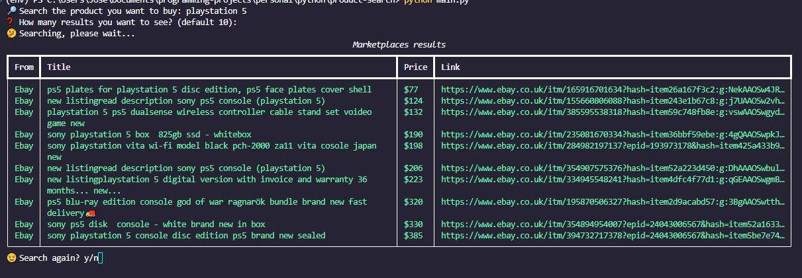

# Product Scraper

## Description

This is a console application that allows you to search for a given product on multiple websites and returns the products that...

- match the search query
- is brand new

## Screenshots

 

## How to Use

1. Clone or download this repository.
2. Activate the virtual environment by running `.\env\Scripts\activate`.
3. Install the required dependencies by running `pip install -r requirements.txt` in the project folder.
4. Run `python main.py` to execute the application.

I have implemented the Factory Design Pattern in this application to make it easier to add more websites for data extraction.
